<div align="justify">

# 200527 - SRZZUARES


## Información General

- **Creado por:** Crystian Enrique Suárez Cuevas
- **Asignatura:** Desarrollo Movil Integral
- **Grado:** 10
- **Grupo:** A
- **Docente:** MTI. Marco Antonio Ramirez Hernandez

# Desarrollo Backend del Videojuego Api Rest"

### Se crearón dos carpetas para el proyecto:

| Carpetas     | Descripción                                                                                                                                                 |
| ------------ | ----------------------------------------------------------------------------------------------------------------------------------------------------------- |
| **Api_Game** | Tendrá el código, como es la conexión de base de datos, creación de rutas, controladores y el entorno de ejecución NodeJs.                                  |
| **Pruebas**  | Dentro de la carpeta **Api_Game**, Se llevará a cabo imágenes como pruebas de recorrido al crear rutas de insertar, actualizar, encontrar y eliminar datos. |

## Api_Game

| Carpetas         | Descripción                                                                                                       |
| ---------------- | ----------------------------------------------------------------------------------------------------------------- |
| **node_modules** | Contendrá los paquetes y funcionalidades para NodeJs.                                                             |
| **src**          | Tendra los archivos y carpetas para el funcionamiento de backend.                                                 |
| **controllers**  | Son archivos que son responsables de manejar las solicitudes del usuario y devolver las respuestas apropiadas..   |
| **models**       | Los modelos se utilizan a menudo en aplicaciones web para representar datos de usuarios, productos , entre otras. |
| **routes**       | Es una carpeta que contiene los archivos JavaScript que definen las rutas de la aplicación.                       |
| **config**       | Es una carpeta que contiene los archivos de configuracion de la aplicación, por ejemplo base de datos.            |
| **lib**          | Librerias                                                                                                         |
| **RestClient**   | Es una carpeta que contiene los archivos http de las rutas que se crearon en el desarrollo del backend.           |

| Archivos         | Descripción                                                                                  |
| ---------------- | -------------------------------------------------------------------------------------------- |
| **package.json** | Es un archivo de configuración que se utiliza en los proyectos de Node.js.                   |
| **.env**         | Es un archivo de configuración que se utiliza para almacenar variables de entorno.           |
| **server.js**    | Se encarga de importar middlewares, las rutas de solicutdes y correr el entorno de ejecución |
| **db.js**        | Este archivo se encarga de conectar la base de datos con el entorno de ejecución NodeJs.     |

| CarpetaControllers      | Descripción                                                                                                          |
| ----------------------- | -------------------------------------------------------------------------------------------------------------------- |
| **playerControlles.js** | Se encarga de recibir la petición y enviar la solicitud a la base de datos o viceversa con la respuesta del usuario. |

| CarpetaModels       | Descripción                                                             |
| ------------------- | ----------------------------------------------------------------------- |
| **playerModels.js** | Se encarga del modelado de datos que está definido en la base de datos. |

| CarpetaRoutes       | Descripción                                                                                       |
| ------------------- | ------------------------------------------------------------------------------------------------- |
| **playerRoutes.js** | Este archivo es para crear rutas para distintas peticiones o solicitudes que requiere el usuario. |

## Paquetes NodeJs del Proyecto Api_Game

Código utilizado en el proyecto:

```bash
# Esto es para dependencias del proyecto
npm i express cors mysql2 sequelize
```

```bash
# Esto es para dependenciasde desarrollo del proyecto
npm i nodemon dotenv bcrypt -D
```

## Actividades del Proyecto Api_Game

| NO. Informes      | Descripción                                                                                                                          |
| ----------------- | ------------------------------------------------------------------------------------------------------------------------------------ |
| **Actividad 1**   | Para esta API Rest del videojuego, se inicio creando la estructura de una arquitectura de software de MVC (modelo vista controlador) |
| **Actividad 1.1** | Se instalo dependencias para el desarrollo de este proyecto como NodeJs, Express, Nodemon, Dotenv, Cors.                             |
| **Actividad 1.2** | Se creó un archivo como el **server.js** para poder importar middlewares, las rutas de solicutdes y correr el entorno de ejecución.  |
| **Actividad 1.3** | Se creó un archivo como el **playerRoutes.js** que contiene las rutas para poder navegar en la web.                                  |
| **Actividad 1.4** | Se creó un archivo como el **playerController.js** para crear las funcionalidades para el CRUD y un archivo                          |
| **Actividad 1.5** | Se creó un archivo como el **.env** que guardara las variables que serán secretas para la base de datos u otra cosa.                 |

## Capturas de Pantalla Actividad 1

<p align="center">
  
  
  
  
  
  
  
  
  
  
  
  
  
 
</p>

---

| NO. Informes      | Descripción                                                                                                                            |
| ----------------- | -------------------------------------------------------------------------------------------------------------------------------------- |
| **Actividad 2**   | Se integro la conexión de base de datos y se creó la ruta de obtener todos los datos de la tabla.                                      |
| **Actividad 2.1** | Dentro de la carpeta config se creo el archivo **db.js** y se implemento la conexión de la base de datos.                              |
| **Actividad 2.2** | Se creó el archivo **playerModel.js** en la carpeta Models y se crea el modelo de la tabla tbb_players                                 |
| **Actividad 2.3** | Se importan rutas de los archivos **db.js y playerModel.js** al **server.js** agregando un try catch para la conexion de base de datos |
| **Actividad 2.4** | Dentro del archivo **playerController.js** se integro código para la obtención de toda la data en la tabla tbb_players                 |

## Capturas de Pantalla Actividad 2

<p align="center">

  
 
</p>

---

| NO. Informes      | Descripción                                                                                                                                |
| ----------------- | ------------------------------------------------------------------------------------------------------------------------------------------ |
| **Actividad 3**   | Se creo Api completa de todas las rutas con funcionalidad de la tabla **tbb_players**                                                      |
| **Actividad 3.1** | Se integro el código para la funcionalidad de buscar por medio de **id** de la tabla **tbb_players**                                       |
| **Actividad 3.2** | Se integro el código para la funcionalidad de buscar por medio de **Email** de la tabla **tbb_players**                                    |
| **Actividad 3.3** | Se integro el código para la funcionalidad de crear datos de la tabla **tbb_players**                                                      |
| **Actividad 3.4** | Se integro el código para la funcionalidad de actualizar datos de la tabla **tbb_players**                                                 |
| **Actividad 3.5** | Se integro el código para la funcionalidad de eliminar permanente los datos de la tabla **tbb_players** por medio de **IdPlayers**         |
| **Actividad 3.6** | Se integro el código para la funcionalidad de actualizar un elemento con **PATCH**, de la tabla **tbb_players** por medio de **IdPlayers** |

## Capturas de Pantalla Actividad 3

<p align="center">

  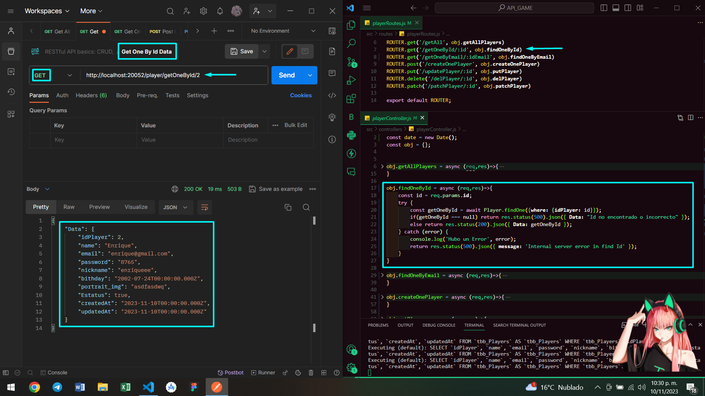
 
  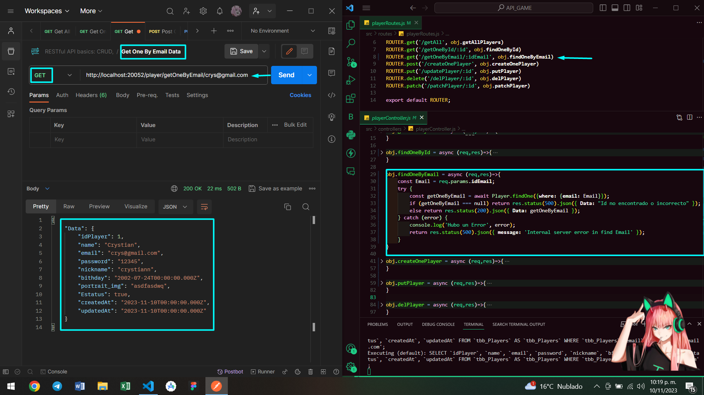
 
  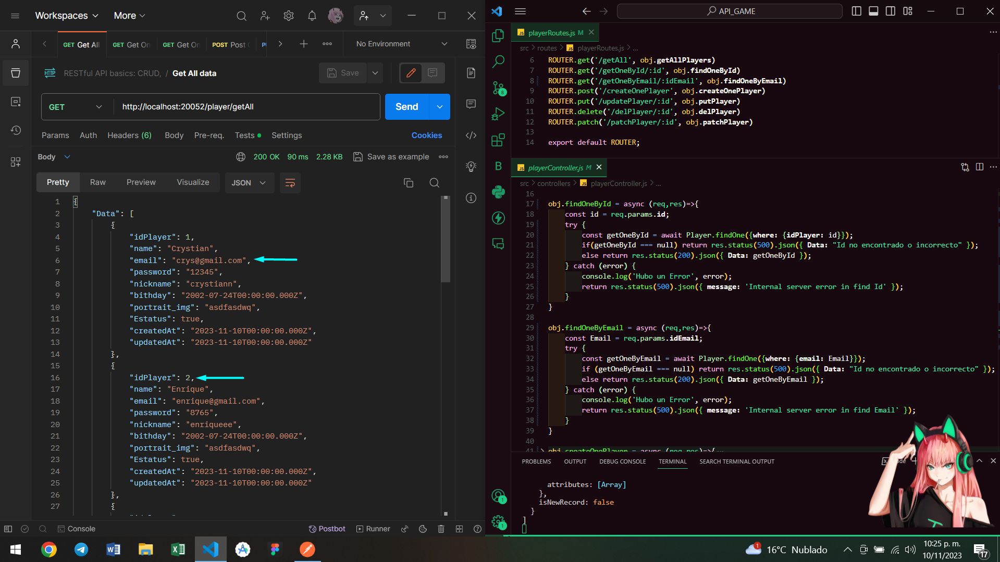
 
 ---

  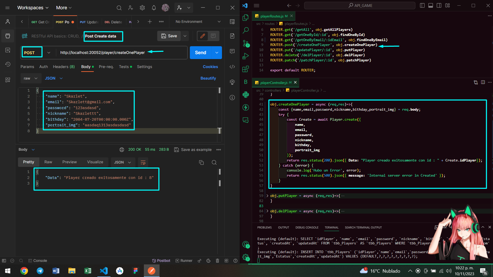
 
  
 
 ---

  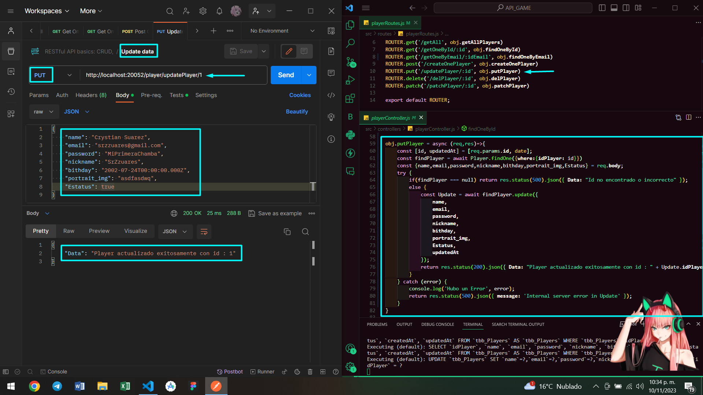
 
  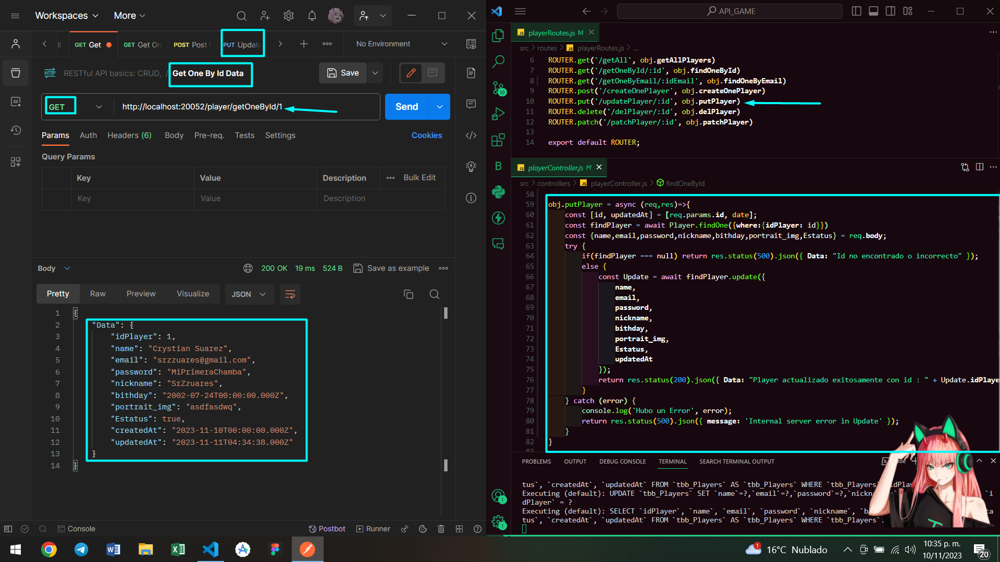
 
 ---

  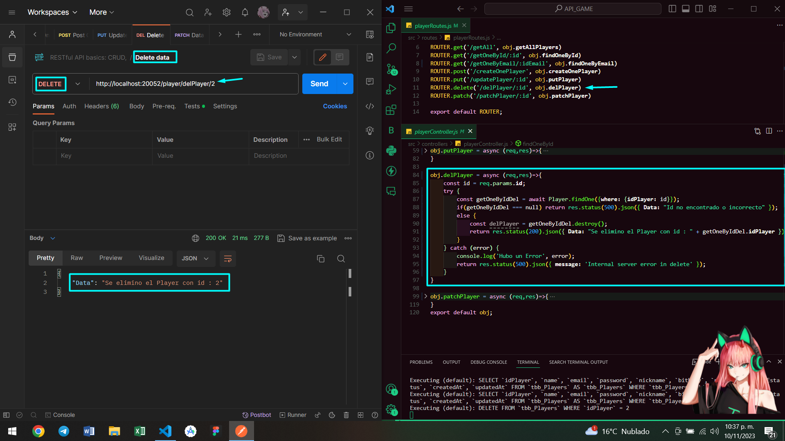
 
  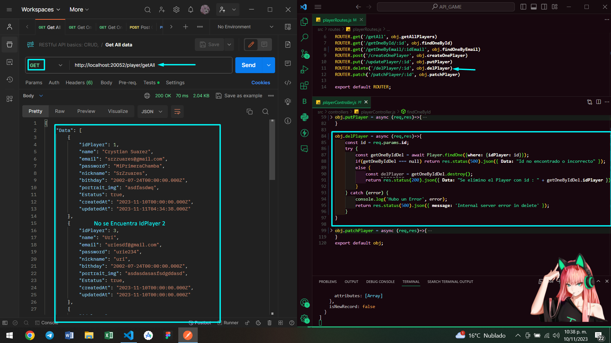
 
 ---

  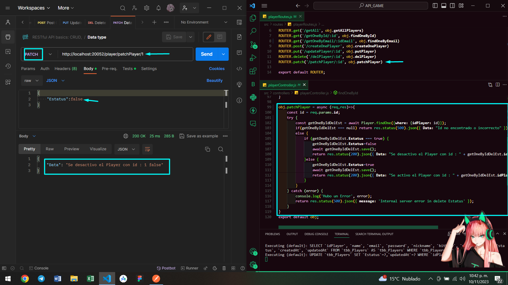
 
  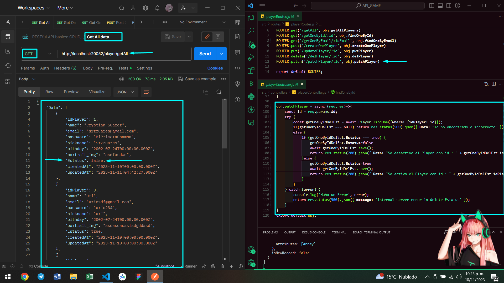
 
  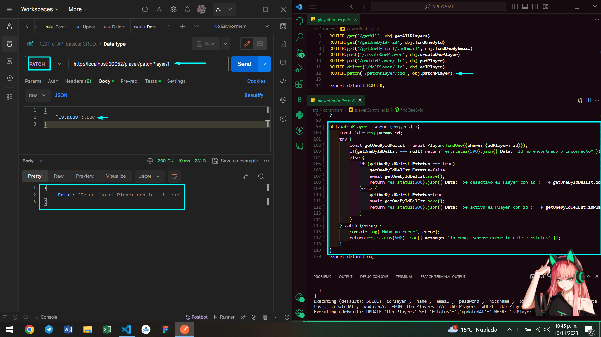
 
  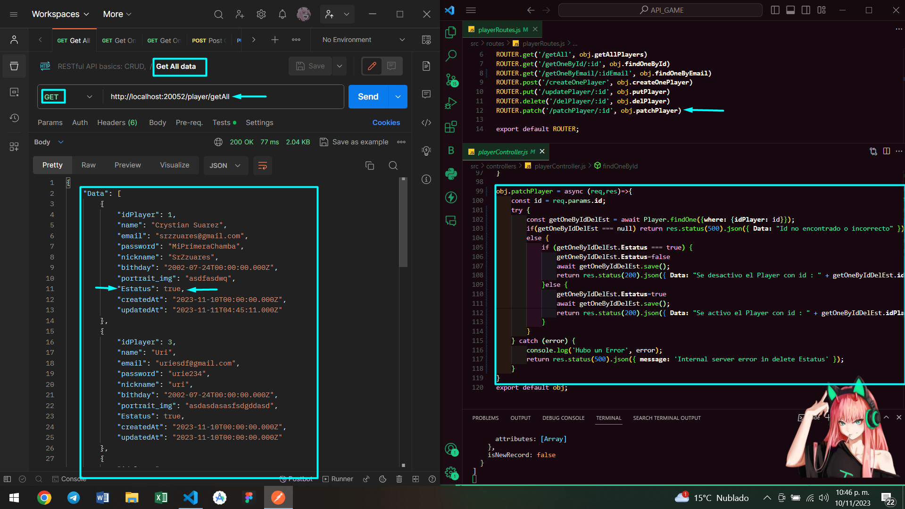
 
 ---

</p>

</div>
